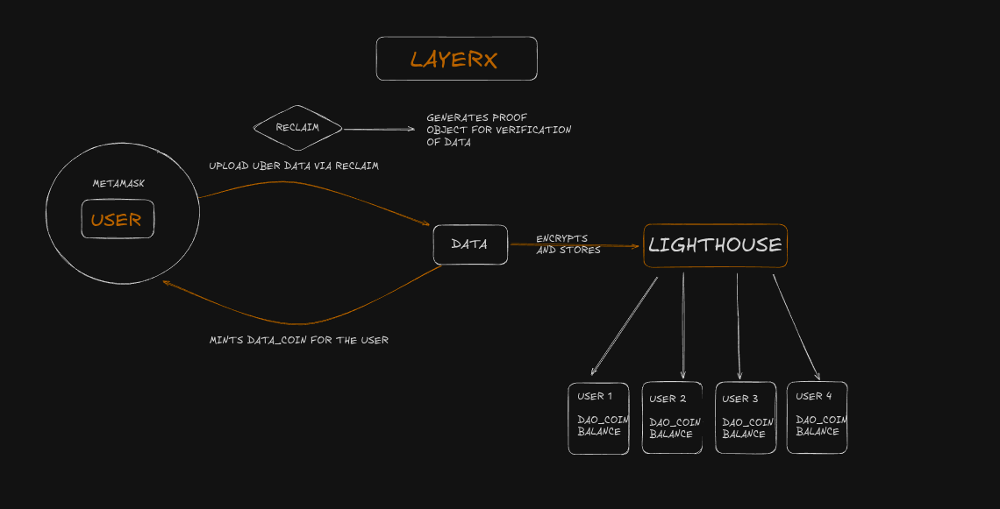
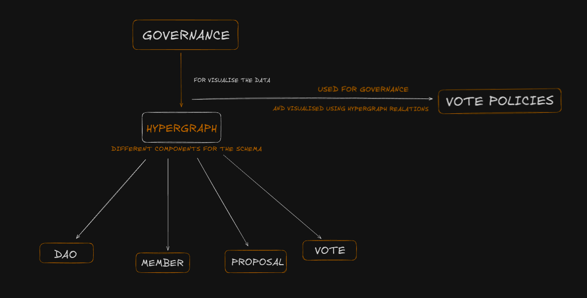

# 🚀 LayerX - DataCoin Portal - Decentralized Data DAO 🛠️

## 🌟 Overview

LayerX is a comprehensive DataDAO platform that combines secure data storage, cryptographic verification, token economics, and decentralized governance. Users can upload their encrypted data, earn DataCoins as rewards, and use their token holdings to participate in platform governance with voting weight proportional to their stake.

## Demo : https://youtu.be/Hzb2NDAZwA8

# System Design

<p align="center">
  
</p>

<p align="center">
  
</p>

## 📱 Usage Guide

### 1. **Connect Your Wallet**

- Click "Connect Wallet" to connect your MetaMask
- Ensure you're on Sepolia testnet
- The app will display your DataCoin balance and total supply

### 2. **Upload Data & Earn Tokens**

- Navigate to "Upload Data" section
- Drag and drop or select `.txt` files
- Complete Reclaim verification (or skip for testing)
- Files are encrypted and stored on IPFS
- Earn 10 DataCoins per successful upload

### 3. **Participate in Governance**

- Go to "Governance" section
- View active proposals and current voting status
- Cast votes using your DataCoin balance
- Your voting weight = your DataCoin holdings
- Watch real-time results and proposal outcomes

### 4. **Monitor Your Impact**

- Track your DataCoin balance in real-time
- See your percentage of total token supply
- View transaction history and minting records
- Monitor the DAO's total token circulation

## 🏗️ Smart Contract Details

### DataCoin Contract

- **Network**: Sepolia Testnet
- **Address**: `0xa14159C1B383fBCa4A9C197aFC83E01DB4655B24`
- **Type**:  https://sepolia.etherscan.io/token/0xa14159c1b383fbca4a9c197afc83e01db4655b24
- **Features**: Role-based access control, vesting, and governance integration

## 🔮 Hypergraph Schema

This document provides a comprehensive overview of the Hypergraph schema used in this governance application, including entity definitions, relationships, and usage examples.

## Overview

This schema implements a decentralized governance system with the following core concepts:
- DAOs: Decentralized Autonomous Organizations
- Voters/Members: Participants with voting power based on token holdings
- Proposals: Governance proposals that can be voted on
- Votes: Individual voting records on proposals


## 🛡️ Why These Technologies?

**Lighthouse Web3** is essential for the DataDAO's success:

- **Data Integrity**: Ensures encrypted data storage with tamper-resistant capabilities
- **Decentralization**: IPFS-based storage removes single points of failure
- **Privacy**: Client-side encryption before upload protects user data

**Reclaim Protocol** provides crucial verification capabilities:

- **Privacy**: Zero-knowledge proofs verify data without revealing sensitive information
- **Trust**: Cryptographic verification ensures data authenticity
- **Scalability**: Efficient verification process supports platform growth

**Hypergraph** enables advanced data relationships and querying:

- **Decentralized Data Management**: Store and query complex data relationships without centralized databases
- **Schema Flexibility**: Define custom entity types and relationships for DAO components
- **Real-time Queries**: Filter and search DAO data efficiently across distributed networks
- **Interoperability**: Connect with other decentralized applications and data sources
- **Scalability**: Handle complex data operations while maintaining decentralization

## 🔧 Development

### Available Scripts

- `npm run dev` - Start development server
- `npm run build` - Build for production

### Project Structure

```
src/
├── components/          # React components
├── backend/            # Backend services and contracts
│   ├── DataCoin.ts    # Smart contract ABI and interface
│   ├── reclaim_server.js # Reclaim Protocol verification server
│   └── web3.ts        # Web3 configuration and utilities
├── assets/            # Static assets
├── App.tsx            # Main application component with routing
├── FileUpload.tsx     # Data upload functionality with token rewards
├── Governance.tsx     # DAO governance interface and voting
├── schema.ts          # Hypergraph entity definitions
├── BalanceContext.tsx # Token balance state management
├── MetaMaskContext.tsx # Wallet connection context
└── main.tsx          # Application entry point
```

### Key Components

- **FileUpload**: Handles file encryption, IPFS upload, and DataCoin minting
- **Governance**: Manages proposal voting with stake-weighted democracy
- **ReclaimVerification**: Zero-knowledge proof verification integration
- **BalanceContext**: Real-time DataCoin balance tracking

## 📊 Token Economics

- **Initial Supply**: 0 (tokens are minted as rewards)
- **Mint Rate**: 10 tokens per verified data upload
- **Governance Weight**: 1 vote per token held
- **Use Cases**: Governance voting, future premium features

## 🌐 Network Information

- **Blockchain**: Ethereum Sepolia Testnet
- **Storage**: IPFS via Lighthouse Web3

---

## ✨ Key Features

### 📁 **Secure Data Storage**

- **Lighthouse Integration**: Encrypted data storage on IPFS using Lighthouse Web3 SDK
- **MetaMask Authentication**: Secure wallet connection and message signing
- **File Encryption**: Client-side encryption before upload to ensure privacy
- **Drag & Drop Interface**: User-friendly file upload experience

### 🔒 **Data Verification with Reclaim Protocol**

- **Zero-Knowledge Proofs**: Cryptographic verification of data authenticity
- **Privacy-Preserving**: Verify data without revealing sensitive information
- **Tamper-Proof**: Immutable proof of data integrity
- **Real-time Validation**: Instant verification status with security feedback

### 🪙 **DataCoin Token Economics**

- **ERC-20 Token**: DataCoin smart contract on Sepolia testnet
- **Earn-to-Contribute**: Users earn tokens for uploading verified data
- **Token Rewards**: 10 DataCoins per successful file upload
- **Real-time Balance**: Live tracking of user balance and total supply
- **Transparent Minting**: All transactions logged and verifiable on-chain

### 🗳️ **Decentralized Governance**

- **Proposal System**: Community-driven decision making
- **Weighted Voting**: Vote weight based on DataCoin holdings
- **Democratic Participation**: Users vote on platform policies and improvements
- **Real-time Results**: Live vote counting and proposal status
- **Stake-based Influence**: Higher token holdings = greater governance influence

### 🔗 **Hypergraph Integration** (Ready for Implementation)

- **Schema Definition**: Structured data relationships for DAO components
- **Entity Relationships**: Define connections between Address, Project, and Event entities
- **Query Capabilities**: Filter and query DAO data efficiently
- **Decentralized Data Management**: Leverage Hypergraph for complex data operations

### Frontend

- **React 19** - Modern UI framework
- **TypeScript** - Type-safe development
- **Vite** - Fast build tool and development server
- **React Router** - Client-side routing

### Blockchain & Web3

- **Web3.js** - Ethereum blockchain interaction
- **Ethers.js** - Ethereum utilities and contract interaction
- **MetaMask** - Wallet connection and authentication
- **Sepolia Testnet** - Ethereum test network

### Data & Storage

- **Lighthouse Web3 SDK** - Decentralized file storage
- **IPFS** - Distributed file system
- **Reclaim Protocol** - Zero-knowledge data verification

### Backend Services

- **Express.js** - RESTful API server
- **Reclaim Verification Server** - Proof generation and validation

### Installation

1. **Clone the repository**

   ```bash
   git clone https://github.com/asmit27rai/hg-test.git
   cd hg-test
   ```

2. **Install dependencies**

   ```bash
   npm install
   ```

3. **Environment Setup**
   Create a `.env` file in the root directory:

   ```env
   VITE_PRIVATE_KEY=your_private_key_here
   ```

4. **Start the development server**

   ```bash
   npm run dev
   ```
